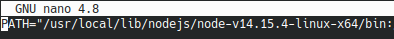
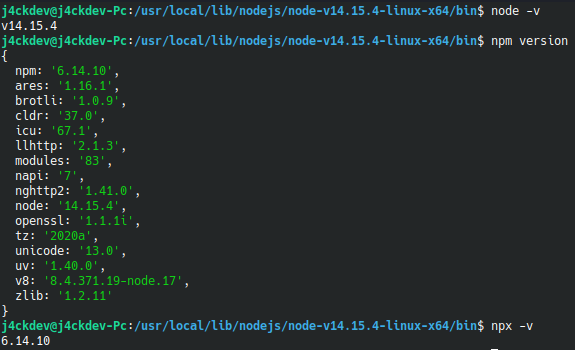

# Instalación de NodeJs

Pasos para instalar NodeJs en **Kubuntu 20.04** y tener disponible el intérprete de Javascript sin hacer uso del navegador. Esta mini guía enseña como instalar la última versión LTS `14.15.4`, pero puede servir para instalar versiones anteriores y nuevas versiones de NodeJs.

1. Descargar el binario para Linux x64 desde [la página oficial](https://nodejs.org/es/download/). En mi caso, obtuve el archivo `node-v14.15.4-linux-x64.tar.xz`.
2. Usar el comando `sudo mkdir -p /usr/local/lib/nodejs` y descomprimir el archivo descargado con el comando `sudo tar -xJvf node-v14.15.4-linux-x64.tar.xz -C /usr/local/lib/nodejs/`
3. Agregar la ubicación `/usr/local/lib/nodejs/node-v14.15.4-linux-x64/bin` al PATH. Se puede usar el comando `sudo nano /etc/environment` para editar el PATH y agregar la ubicación, luego guarda los cambios con `ctrl-o`. A continuación muestro como debería quedar:

    <div align=center>

    

    </div>

4. Ejecutar el comando ` source /etc/environment` para actualizar los cambios y ejecutar los siguientes comandos para probar que la instalación fue realizada correctamente:

    ```bash
    node -v
    npm version
    npx -v
    ```

    Deberías obtener un resultado similar al siguiente:

    <div align=center>

    

    </div>

5. Por último, cierra la sesión de tu usuario en Kubuntu y vuelve a abrirla para mantener los cambios en el PATH. Con esto ya quedaría todo listo para probar los archivos Javascript sin navegador mediante el comando `node nombrearchivo.js`.

Es importante mencionar que `alert()` no funciona en consola, por lo que para mostrar mensajes o información se debe usar `console.log()`.